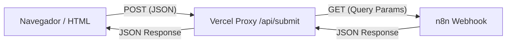

# Guía Técnica: Integración de Landings con Webhooks de n8n

Esta guía explica la arquitectura óptima para conectar formularios web o dashboards directamente con n8n, evitando errores comunes de **CORS** y problemas de **métodos HTTP**.

## 1. El Problema: ¿Por qué falla la llamada directa?

Generalmente, al intentar llamar a un webhook de n8n desde el navegador (`fetch` en JavaScript), ocurren dos errores:
1.  **CORS (Cross-Origin Resource Sharing):** El navegador bloquea la petición porque n8n está en un dominio diferente al de tu web.
2.  **Métodos HTTP:** n8n a veces espera un `GET` con parámetros en la URL, mientras que los formularios HTML nativos o `fetch` suelen enviar un `POST` con JSON.

## 2. La Solución: Vercel Serverless Function (Proxy)

La mejor práctica es usar una función intermedia (Proxy) en el servidor. Esto permite:
- **Ocultar la URL de n8n:** Nadie puede ver tu webhook inspeccionando el código de la web.
- **Saltar el CORS:** Las peticiones de servidor a servidor (Vercel → n8n) no tienen restricciones de CORS.
- **Mapeo de Datos:** Puedes recibir un `POST` JSON y enviarlo a n8n como un `GET` con parámetros.

### Arquitectura de Comunicación


## 3. Implementación Paso a Paso

### A. El Proxy (Vercel)
Crea una carpeta `api/` en tu repositorio y añade un archivo (ej: `submit.js` o `login.js`):

```javascript
// api/login.js
const N8N_WEBHOOK = 'https://tu-n8n.host/webhook/id-del-webhook';

module.exports = async function handler(req, res) {
  // 1. Configurar CORS para que tu propia web pueda hablar con el proxy
  res.setHeader('Access-Control-Allow-Origin', '*');
  res.setHeader('Access-Control-Allow-Methods', 'POST, OPTIONS');
  res.setHeader('Access-Control-Allow-Headers', 'Content-Type');

  if (req.method === 'OPTIONS') return res.status(200).end();

  try {
    const data = req.body;
    
    // 2. Convertir JSON POST a Query Params (Mejor práctica para n8n)
    const params = new URLSearchParams();
    for (const [key, value] of Object.entries(data)) {
      params.append(key, String(value));
    }

    // 3. Llamada a n8n
    const url = `${N8N_WEBHOOK}?${params.toString()}`;
    const response = await fetch(url);
    const json = await response.json();

    // 4. Devolver respuesta a la web
    res.status(response.status).json(json);
  } catch (error) {
    res.status(500).json({ error: 'Error de conexión con el backend' });
  }
};
```

### B. El Frontend (JavaScript)
En tu `index.html`, ya no llamas a la URL larga de n8n, sino a tu propio endpoint:

```javascript
const WEBHOOK_URL = '/api/login';

async function enviar() {
  const res = await fetch(WEBHOOK_URL, {
    method: 'POST',
    headers: { 'Content-Type': 'application/json' },
    body: JSON.stringify({ Email: 'user@example.com', Codigo: 'abc' }),
  });
  const data = await res.json();
  console.log('Respuesta de n8n:', data);
}
```

### C. El Workflow en n8n
Para que la web sepa que el envío fue exitoso, n8n **DEBE** responder explícitamente:
1. **Nodo Webhook:** Configúralo en método `GET` (o el que use tu proxy).
2. **Nodo Respond to Webhook:** Añádelo al final del flujo.
   - **Response Body:** `{"ok": true, "mensaje": "Datos recibidos"}`.
   - Sin este nodo, n8n puede devolver un error 500 aunque procese los datos.

## 4. Diferencia entre Test y Producción

- **Webhook de Test (`/webhook-test/`):** Solo funciona si tienes el botón "Listen for test event" pulsado en n8n. Se apaga tras una sola llamada. Úsalo solo para desarrollo.
- **Webhook de Producción (`/webhook/`):** Funciona siempre, pero requiere que el workflow esté en **"Active"** (interruptor arriba a la derecha). No verás los datos en el lienzo, tendrás que ir a la pestaña **"Executions"** para ver los registros.

## 5. Resumen de Errores Comunes
- **404:** El webhook no está registrado (no has pulsado "Listen" en Test o no está en "Active" en Prod).
- **500:** n8n recibió los datos pero falló un nodo interno o falta el nodo de respuesta.
- **CORS:** Estás intentando llamar a n8n directamente desde el navegador en vez de usar el `/api/` proxy.
